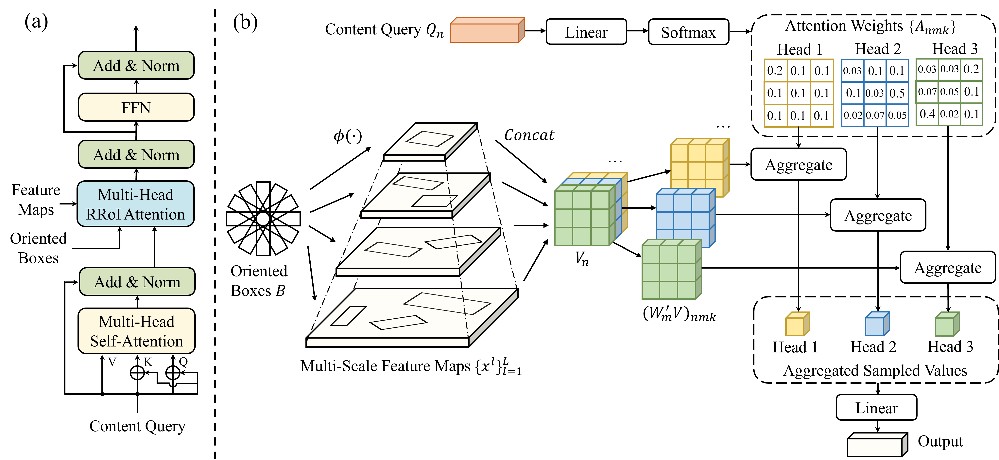
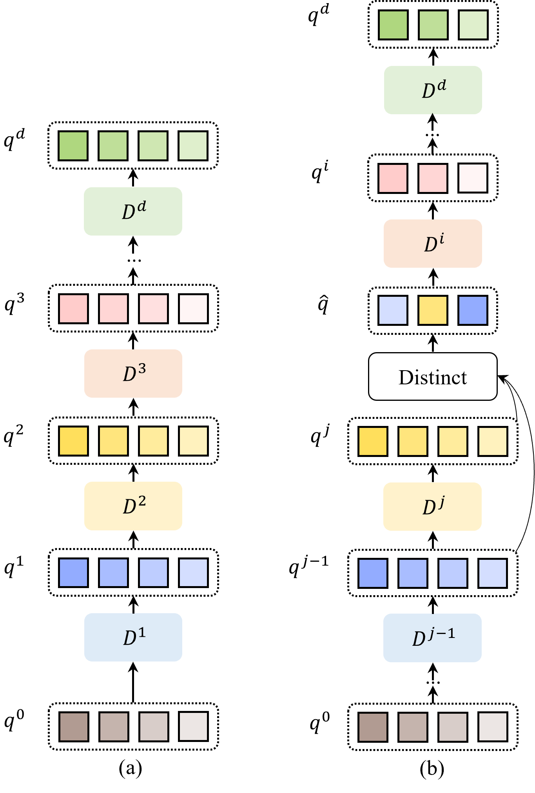
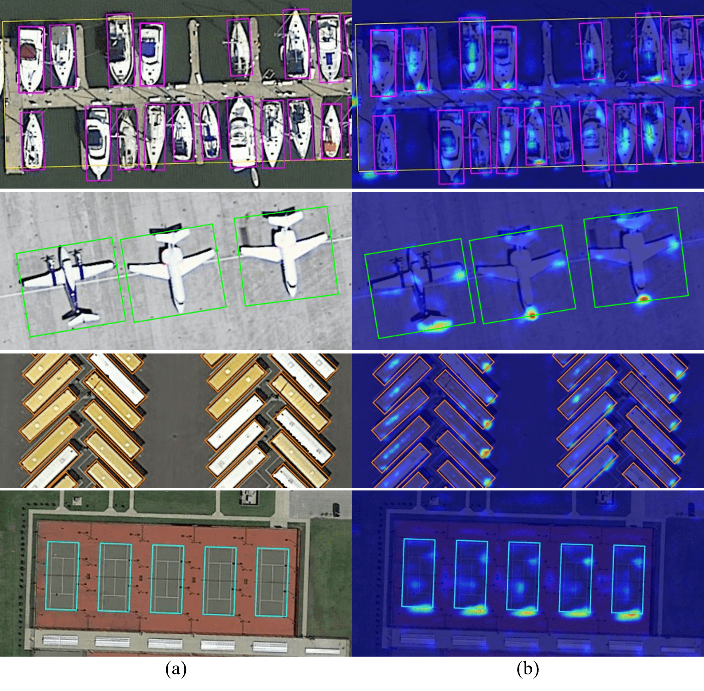

## (ESWA2025) RQFormer : Rotated Query Transformer for end-to-end oriented object detection 
Paper link   https://www.sciencedirect.com/science/article/pii/S0957417424029014

arxiv link https://arxiv.org/abs/2311.17629

## Introduction

RQFormer is an end-to-end transformer-based oriented object detector.

RRoI Attention is shown below.


Selective Distinct Query is shown below.

<div align="center">

</div>

NEW

&#x2705; ICDAR2015 Dataset in MMRotate-1.x

&#x2705; ICDAR2015 Metric  in MMRotate-1.x

&#x2705; ChannelMapperWithGN in MMRotate-1.x

&#x2705; RBBoxL1Cost in MMRotate-1.x

&#x2705; RotatedIoUCost in  MMRotate-1.x

&#x2705; TopkHungarianAssigner in MMRotate-1.x

If you like it, please click on star.


## Installation

Please refer to [Installation](https://mmrotate.readthedocs.io/en/1.x/get_started.html) for more detailed instruction.

**Note**: Our codes base on the newest version mmrotate-1.x, not mmrotate-0.x.

**Note**: All of our codes can be found in [path](projects/RQFormer/) './projects/RQFormer/'.

You can also copy these [codes](projects/RQFormer/) to your own mmrotate-1.x codabase.

## Data Preparation for Oriented Detection

DOTA and DIOR-R : Please refer to [Preparation](https://github.com/open-mmlab/mmrotate/tree/1.x/tools/data) for more detailed data preparation.

ICDAR2015 : (1) Download ICDAR2015 dataset from [official link](https://rrc.cvc.uab.es/?ch=4&com=introduction).
(2) The data structure is as follows:

```none
root
├── icdar2015
│   ├── ic15_textdet_train_img
│   ├── ic15_textdet_train_gt
│   ├── ic15_textdet_test_img
│   ├── ic15_textdet_test_gt
```

## Training


1. We train DIOR-R on a single 2080ti with batch 2.
```bash
python tools/train.py projects/RQFormer/configs/rroiformer_le90_r50_q500_layer2_sq1_dq1_t0.85_3x_dior.py
```

2. We train DOTA-v1.0 on a single 2080ti with batch 2.

```bash
python tools/train.py projects/RQFormer/configs/rroiformer_le90_r50_q500_layer2_sq1_dq1_t0.9_2x_dotav1.0.py
```
3. We train  DOTA-v1.5 on two 2080ti with batch 4 (2 images per gpu).

```bash
bash tools/dist_train.sh projects/RQFormer/configs/rroiformer_le90_r50_q500_layer2_sq1_dq1_t0.9_2x_dotav1.5.py 2
```
4. We train  DOTA-v2.0 on two 2080ti with batch 4 (2 images per gpu).

```bash
bash tools/dist_train.sh projects/RQFormer/configs/rroiformer_le90_r50_q500_layer2_sq1_dq1_t0.9_2x_dotav2.0.py 2
```
5. We train ICDAR2015 on two 2080ti with batch 4 (2 images per gpu).

```bash
bash tools/dist_train.sh projects/RQFormer/configs/rroiformer_le90_r50_q500_layer2_sq1_dq1_t0.9_160e_icdar2015.py 2
```
6. We also implement Oriented DDQ adapted from [DDQ](https://arxiv.org/abs/2303.12776). It train DIOR-R on a single 200ti with batch 2.

```bash
python tools/train.py projects/RQFormer/configs/oriented_ddq_le90_r50_q300_layer2_1x_dior.py
```
## Testing
1. Test on DIOR-R
```bash
python tools/test.py projects/RQFormer/configs/rroiformer_le90_r50_q500_layer2_sq1_dq1_t0.85_3x_dior.py rroiformer_le90_r50_q500_layer2_sq1_dq1_t0.85_3x_dior.pth
```
2. Test on DOTA-v1.0
```bash
python tools/test.py projects/RQFormer/configs/rroiformer_le90_r50_q500_layer2_sq1_dq1_t0.9_2x_dotav1.0.py rroiformer_le90_r50_q500_layer2_sq1_dq1_t0.9_2x_dotav1.0.pth
```
Upload results to DOTA official [website](https://captain-whu.github.io/DOTA/evaluation.html).

3. Test on DOTA-v1.5
```bash
python tools/test.py projects/RQFormer/configs/rroiformer_le90_r50_q500_layer2_sq1_dq1_t0.9_2x_dotav1.5.py rroiformer_le90_r50_q500_layer2_sq1_dq1_t0.9_2x_dotav1.5.pth
```
Upload results to DOTA official [website](https://captain-whu.github.io/DOTA/evaluation.html).

4. Test on DOTA-v2.0
```bash
python tools/test.py projects/RQFormer/configs/rroiformer_le90_r50_q500_layer2_sq1_dq1_t0.9_2x_dotav2.0.py rroiformer_le90_r50_q500_layer2_sq1_dq1_t0.9_2x_dotav2.0.pth
```
Upload results to DOTA official [website](https://captain-whu.github.io/DOTA/evaluation.html).

5. Test on ICDAR2015

(1) Get result submit.zip
```bash
python tools/test.py projects/RQFormer/configs/rroiformer_le90_r50_q500_layer2_sq1_dq1_t0.9_160e_icdar2015.py rroiformer_le90_r50_q500_layer2_sq1_dq1_t0.9_160e_icdar2015.pth
```
(2) Calculate precision, recall and F-measure. The script.py adapted from [official website](https://rrc.cvc.uab.es/?ch=4&com=mymethods&task=1).
```bash
pip install Polygon3
python projects/icdar2015_evaluation/script.py –g=projects/icdar2015_evaluation/gt.zip –s=submit.zip
```

## Main Result
**RQFormer** :

|Dataset|AP50|AP75|mAP|Backbone|lr schd|batch|Angle|Query|Configs|Aug|Baidu|魔塔(比百度网盘快)|
|--|--|--|--|--|--|--|--|--|--|--|--|--|
|DIOR-R|67.31|47.36|-|R50|3x|2|le90|500|[rroiformer_le90_r50_q500_layer2 _sq1_dq1_t0.85_3x_dior.py](./projects/RQFormer/configs/rroiformer_le90_r50_q500_layer2_sq1_dq1_t0.85_3x_dior.py)|-|[model \| log](https://pan.baidu.com/s/1f6W3hjU_V6iLMsGZjck_dA?pwd=a1vd )|[model \| log](https://www.modelscope.cn/models/wokaikaixinxin/RQFormer/files)|
|DOTA-v1.0|75.04|49.22|46.73|R50|2x|2|le90|500|[rroiformer_le90_r50_q500_layer2 _sq1_dq1_t0.9_2x_dotav1.0.py](./projects/RQFormer/configs/rroiformer_le90_r50_q500_layer2_sq1_dq1_t0.9_2x_dotav1.0.py)|single scale|[model \| log \| results](https://pan.baidu.com/s/1ShkGD7aIVFYfhrvz_60eYg?pwd=qv6a)|[model \| log](https://www.modelscope.cn/models/wokaikaixinxin/RQFormer/files)|
|DOTA-v1.5|67.43|42.62|41.36|R50|2x|2gpu*2img|le90|500|[rroiformer_le90_r50_q500_layer2 _sq1_dq1_t0.9_2x_dotav1.5.py](./projects/RQFormer/configs/rroiformer_le90_r50_q500_layer2_sq1_dq1_t0.9_2x_dotav1.5.py)|single scale|[model \| log \| results](https://pan.baidu.com/s/1EASJM3AIMuZCQWdWTJ28Cw?pwd=iioq)|[model \| log](https://www.modelscope.cn/models/wokaikaixinxin/RQFormer/files)|
|DOTA-v2.0|53.28|30.31|31.02|R50|2x|2gpu*2img|le90|500|[rroiformer_le90_r50_q500_layer2 _sq1_dq1_t0.9_2x_dotav2.0.py](./projects/RQFormer/configs/rroiformer_le90_r50_q500_layer2_sq1_dq1_t0.9_2x_dotav2.0.py)|single scale|[model \| log \| results](https://pan.baidu.com/s/1VEdSByfrz5IVKVnGay-sjg?pwd=xats)|[model \| log](https://www.modelscope.cn/models/wokaikaixinxin/RQFormer/files)|

|Dataset|P|R|F-measure|Backbone|lr schd|batch|Angle|Query|Configs|Baidu|魔塔(比百度网盘快)|
|--|--|--|--|--|--|--|--|--|--|--|--|
|ICDAR2015|0.850406504065|0.7554164660568|0.800101988781|R50|160e|2gpu*2img|le90|500|[rroiformer_le90_r50_q500_layer2_sq1_dq1_t0.9_160e_icdar2015.py](./projects/RQFormer/configs/rroiformer_le90_r50_q500_layer2_sq1_dq1_t0.9_160e_icdar2015.py)|[model \| log \| submit](https://pan.baidu.com/s/1omXoX2iJMVIzdnBx6zt6Cg?pwd=tp1l)|[model \| log](https://www.modelscope.cn/models/wokaikaixinxin/RQFormer/files)|

**Oriented DDQ** :
|Dataset|AP50|Backbone|lr schd|batch|Angle|Query|Configs|Baidu|魔塔(比百度网盘快)|
|--|--|--|--|--|--|--|--|--|--|
|DIOR-R|61.66|R50|1x|2|le90|300|[oriented_ddq_le90_r50_q300_layer2_1x_dior.py](./projects/RQFormer/configs/oriented_ddq_le90_r50_q300_layer2_1x_dior.py)|[model \| log](https://pan.baidu.com/s/1QJKMgWQt6YSHkKt7BbBAFQ?pwd=qlq5)|[model \| log](https://www.modelscope.cn/models/wokaikaixinxin/RQFormer/files)
|DIOR-R|66.51|R50|3x|4|le90|500|[oriented_ddq_le90_r50_q500_layer2_3x_dior.py](./projects/RQFormer/configs/oriented_ddq_le90_r50_q500_layer2_3x_dior.py)|[modle \| log](https://pan.baidu.com/s/1SOKILJ65-GowdAppzNi3dA?pwd=6ow5)|[model \| log](https://www.modelscope.cn/models/wokaikaixinxin/RQFormer/files)


**Oriented DDQ + RRoI Attention** :
|Dataset|AP50|Backbone|lr schd|batch|Angle|Query|Configs|Baidu|魔塔(比百度网盘快)|
|--|--|--|--|--|--|--|--|--|--|
|DIOR-R|67.11|R50|3x|4|le90|500|[oriented_ddq_le90_r50_q500_layer2_rroiattn_3x_dior.py](./projects/RQFormer/configs/oriented_ddq_le90_r50_q500_layer2_rroiattn_3x_dior.py)|[model \| log](https://pan.baidu.com/s/1SNhoWmiNxVXorQ49gnPFyA?pwd=04lg)[model \| log](https://pan.baidu.com/s/1QJKMgWQt6YSHkKt7BbBAFQ?pwd=qlq5)|[model \| log](https://www.modelscope.cn/models/wokaikaixinxin/RQFormer/files)|
|DOTA-v1.0|74.05|R50|2x|4|le90|500|[oriented_ddq_le90_r50_q500_layer2_rroiattn_2x_dotav1.0.py](./projects/RQFormer/configs/oriented_ddq_le90_r50_q500_layer2_rroiattn_2x_dotav1.0.py)|[model \| log](https://pan.baidu.com/s/1aXOw2NE1HJDwFw04xxq9PA?pwd=2abr)[model \| log](https://pan.baidu.com/s/1QJKMgWQt6YSHkKt7BbBAFQ?pwd=qlq5)|[model \| log](https://www.modelscope.cn/models/wokaikaixinxin/RQFormer/files)|


## Visualization

<div align="center">

</div>


## Citing RQFormer
If you find RQFormer useful in your research, please consider citing:
```bibtex
@article{zhao2025rqformer,
  title={RQFormer: Rotated Query Transformer for end-to-end oriented object detection},
  author={Zhao, Jiaqi and Ding, Zeyu and Zhou, Yong and Zhu, Hancheng and Du, Wen-Liang and Yao, Rui and El Saddik, Abdulmotaleb},
  journal={Expert Systems with Applications},
  volume={266},
  pages={126034},
  year={2025},
  publisher={Elsevier}
}
```

## Recommendation

Our codes construct on:

```bibtex
@inproceedings{zhou2022mmrotate,
  title   = {MMRotate: A Rotated Object Detection Benchmark using PyTorch},
  author  = {Zhou, Yue and Yang, Xue and Zhang, Gefan and Wang, Jiabao and Liu, Yanyi and
             Hou, Liping and Jiang, Xue and Liu, Xingzhao and Yan, Junchi and Lyu, Chengqi and
             Zhang, Wenwei and Chen, Kai},
  booktitle={Proceedings of the 30th ACM International Conference on Multimedia},
  pages = {7331–7334},
  numpages = {4},
  year={2022}
}

@inproceedings{zhang2023dense,
  title={Dense Distinct Query for End-to-End Object Detection},
  author={Zhang, Shilong and Wang, Xinjiang and Wang, Jiaqi and Pang, Jiangmiao and Lyu, Chengqi and Zhang, Wenwei and Luo, Ping and Chen, Kai},
  booktitle={Proceedings of the IEEE/CVF Conference on Computer Vision and Pattern Recognition},
  pages={7329--7338},
  year={2023}
}
```
